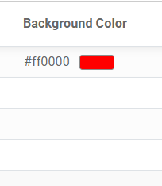

# Color Picker widget for Odoo web client

Display Color Picker for Odoo 13.0 in HEX code.<br/>
Using library from awesome [Bootstrap Colorpicker](https://github.com/itsjavi/bootstrap-colorpicker/) <br/><br/>
<a href="https://github.com/itsjavi/bootstrap-colorpicker/">
    
</a>

## Features
 - Display Color Picker for Odoo in HEX code.<br/><br/>
 - Display the color on form view when you are not editing it<br/>
   <br/><br/>
 - Display the color on form view when you editing it<br/>
   <br/><br/>
 - Display the color in tree view <br/>
   

## Usage
 1. Field declaration.
    ```
    color = fields.Char(
        string="Color Picker",
    )
    ```
    <br/>
 2. Declare in form view
    ```    
    <field name="arch" type="xml">
        <form string="View name">
            ...
            <field name="color" widget="colorpicker"/>
            ...
        </form>
    </field>
    ```
    <br/>
 3. Declare in tree view
    ```
    <field name="arch" type="xml">
        <tree string="View name">
            ...
            <field name="color" widget="colorpicker"/>
            ...
        </form>
    </field>
    ```